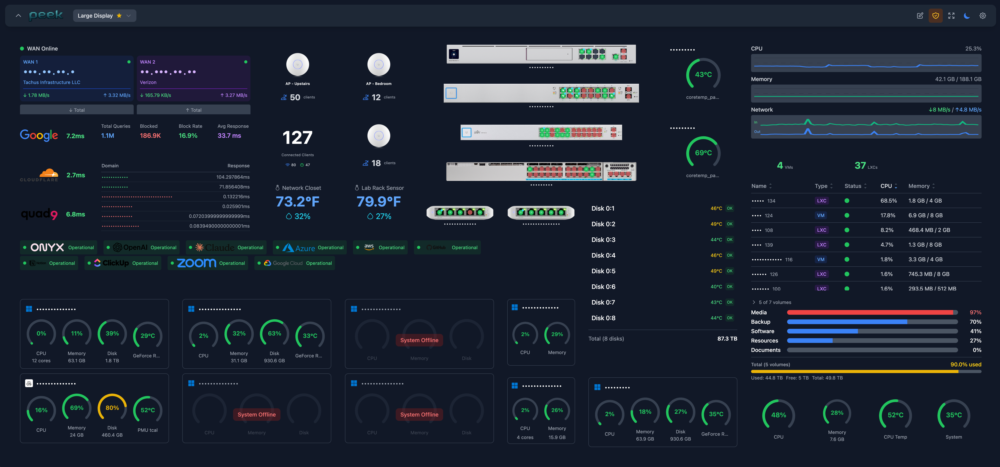
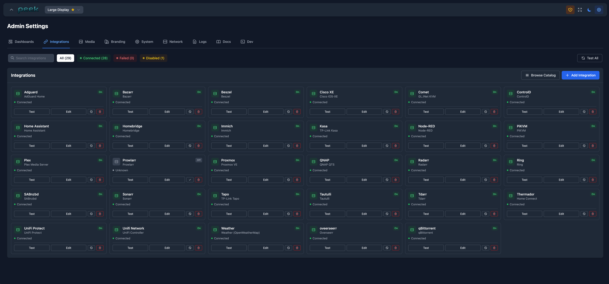
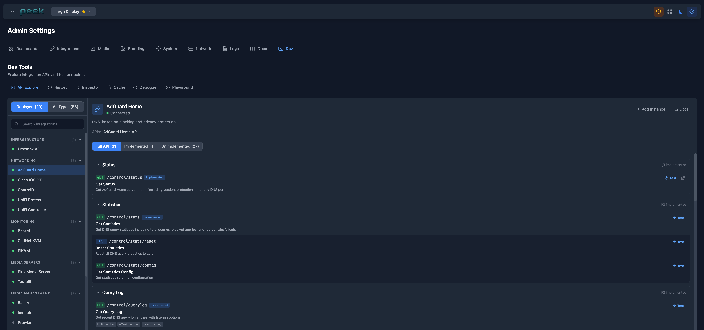
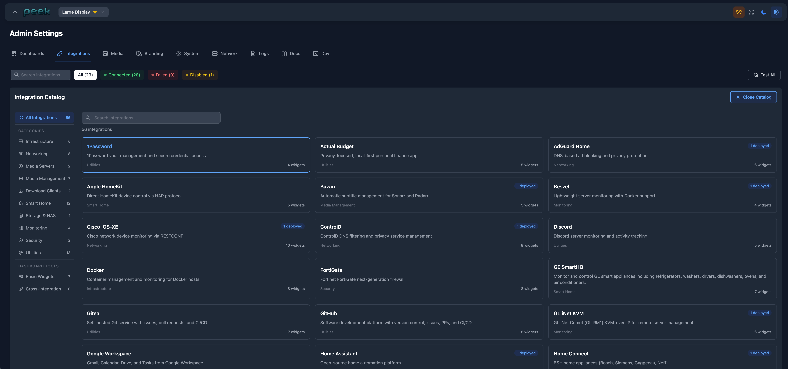

# Peek

A modern, self-hosted dashboard for monitoring home lab infrastructure. Built with React, TypeScript, and Express.



> **Note**: This is a personal project that was primarily designed for my own home lab needs. It has been developed through "vibe coding" - built quickly to solve my specific problems without extensive testing or production hardening. Use at your own risk.

## Disclaimer

**THIS SOFTWARE IS PROVIDED "AS IS", WITHOUT WARRANTY OF ANY KIND, EXPRESS OR IMPLIED.**

By using this software, you acknowledge and agree that:

- This is a hobby project with **no warranty, no support, and no guarantees** of any kind
- The software may contain bugs, security vulnerabilities, or other issues
- **No technical support** is provided - you are on your own
- The author(s) are **not responsible** for any damage, data loss, security breaches, or other issues that may arise from using this software
- This software connects to various third-party services and APIs - ensure you understand the security implications
- **Use in production environments is at your own risk**
- The author(s) reserve the right to abandon this project at any time without notice

If you need a production-ready, supported dashboard solution, please consider commercial alternatives.

---

## Features

- **Multi-Dashboard Support** - Create multiple dashboards with different layouts
- **50+ Integrations** - Connect to Proxmox, UniFi, Plex, Home Assistant, and more
- **Widget Groups** - Organize widgets into collapsible groups
- **Multiple Visualizations** - Configure widgets with different display styles
- **Dark Mode** - System, light, and dark theme options
- **Kiosk Mode** - Fullscreen display mode for wall-mounted screens
- **Import/Export** - Backup and restore dashboards and configurations
- **Image Libraries** - Organize and use custom images in widgets
- **Built-in Documentation** - Access guides directly from the admin panel
- **Dev Tools** - API explorer for testing integration endpoints





## Quick Start

### Docker (Recommended)

```bash
# Clone the repository
git clone https://github.com/unwrntd/peek.git
cd peek

# Start with Docker Compose
docker compose -f docker/docker-compose.yml up -d

# Access at http://localhost:8080
```

### Proxmox LXC Container

A script is provided to automatically create and configure an LXC container on Proxmox:

```bash
curl -fsSL "https://raw.githubusercontent.com/unwrntd/peek/main/scripts/create-lxc.sh" | bash
```

### Environment Variables

| Variable | Description | Default |
|----------|-------------|---------|
| `PORT` | Server port | `3001` |
| `DATA_DIR` | Data directory path | `./data` |
| `NODE_ENV` | Environment mode | `development` |
| `ALLOWED_ORIGINS` | CORS allowed origins (comma-separated) | `*` (all) |

### Security Configuration

For production deployments, configure CORS to restrict access:

```bash
# In docker-compose.yml or environment
ALLOWED_ORIGINS=https://peek.example.com,https://dashboard.local
```

## Architecture

```
peek/
├── backend/           # Express.js API server
│   ├── src/
│   │   ├── database/      # SQLite database management
│   │   ├── integrations/  # 50+ service adapters
│   │   ├── middleware/    # Security, rate limiting
│   │   ├── routes/        # API endpoints
│   │   └── utils/         # Utilities
│   └── package.json
├── frontend/          # React SPA
│   ├── src/
│   │   ├── components/    # React components
│   │   ├── config/        # Integration configurations
│   │   ├── hooks/         # Custom React hooks
│   │   └── stores/        # Zustand state management
│   └── package.json
├── docker/            # Docker configuration
├── scripts/           # Deployment scripts
└── docs/              # Documentation
```

## Supported Integrations

> **Warning**: Many integrations are currently untested and may not work correctly. This project was built primarily for my own use case, so only integrations I actively use have been thoroughly tested. If you encounter issues with a specific integration, you may need to debug and fix it yourself.



### Infrastructure & Virtualization
- Proxmox VE - Virtual machine and container management
- QNAP NAS - Storage and system monitoring
- Beszel - Server monitoring
- PiKVM - KVM over IP
- Kasm Workspaces - Virtual desktop infrastructure
- ESXi - VMware hypervisor

### Networking
- UniFi Controller - Network device monitoring
- UniFi Protect - Security camera system
- AdGuard Home - DNS ad blocking
- Cisco IOS XE - Network device management
- NetAlertX - Network device detection
- FortiGate, MikroTik, PAN-OS - Firewall/router management

### Media Servers
- Plex Media Server - Media streaming
- Tautulli - Plex statistics and monitoring
- Immich - Self-hosted photo management

### Media Management
- Sonarr - TV show management
- Radarr - Movie management
- Bazarr - Subtitle management
- Tdarr - Media transcoding
- Overseerr - Media requests
- Prowlarr - Indexer management

### Download Clients
- SABnzbd - Usenet downloads
- qBittorrent - Torrent downloads

### Smart Home
- Home Assistant - Home automation
- Homebridge - HomeKit bridge
- HomeKit - Apple HomeKit devices
- TP-Link Tapo - Smart devices
- TP-Link Kasa - Smart devices
- Ring - Security devices
- Home Connect - Smart appliances
- Ecobee - Smart thermostats

### Productivity
- Notion - Workspace integration
- Gitea - Git repository hosting
- GitHub - Repository monitoring
- Discord - Server monitoring
- Slack - Workspace integration
- Linear - Issue tracking

### Other
- Ollama - Local LLM server
- Node-RED - Flow-based automation
- Actual Budget - Personal finance
- Paperless-ngx - Document management
- Wazuh - Security monitoring
- Weather - Weather forecasts (via Open-Meteo)
- Sonos - Audio system control

## Security Features

Peek includes several security measures (though **no guarantees are made about their effectiveness**):

### Rate Limiting
- API endpoints: 100 requests per 15 minutes
- Auth endpoints: 10 requests per minute
- Data endpoints: 200 requests per minute

### Security Headers
- Content Security Policy (CSP)
- X-Frame-Options (clickjacking protection)
- X-Content-Type-Options (MIME sniffing protection)
- Referrer-Policy
- Permissions-Policy

### Request Tracing
- Unique request IDs for audit trails
- Request logging with sanitized credentials

### Input Validation
- Search parameter length limits
- File upload type restrictions
- SQL parameterized queries

## Development

### Prerequisites
- Node.js 20+
- npm or yarn
- Python 3 (for Kasa device support)

### Setup

```bash
# Install dependencies
cd backend && npm install
cd ../frontend && npm install

# Start development servers
cd backend && npm run dev    # API on :3001
cd frontend && npm run dev   # UI on :5173
```

### Building

```bash
# Build frontend
cd frontend && npm run build

# Build backend
cd backend && npm run build

# Or build Docker image
docker compose -f docker/docker-compose.yml build
```

## Documentation

- [Getting Started](docs/README.md)
- [Adding Integrations](docs/ADDING_INTEGRATIONS.md) - Guide for creating new integrations
- [Widget Configuration](docs/WIDGETS.md) - Widget visualizations and filters
- [API Reference](docs/API.md) - Backend REST API documentation
- [Security Guide](docs/SECURITY.md) - Security features and deployment recommendations

You can also access documentation directly in the app via **Admin Settings > Docs**.

## Contributing

This is a personal project and contributions may or may not be accepted. If you'd like to contribute:

1. Fork the repository
2. Create a feature branch
3. Make your changes
4. Submit a pull request

**Note**: There is no guarantee that pull requests will be reviewed or merged in a timely manner (or at all).

## License

MIT License - see [LICENSE](LICENSE) file for details.

**THE SOFTWARE IS PROVIDED "AS IS", WITHOUT WARRANTY OF ANY KIND.**
